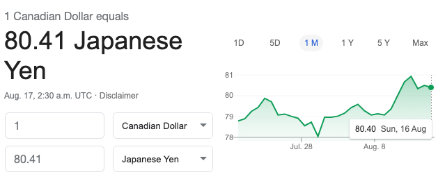
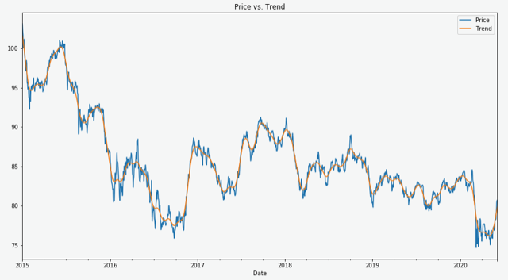
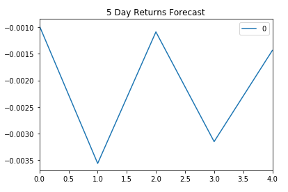
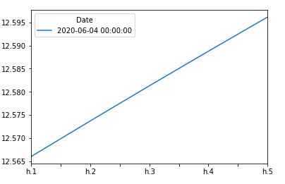
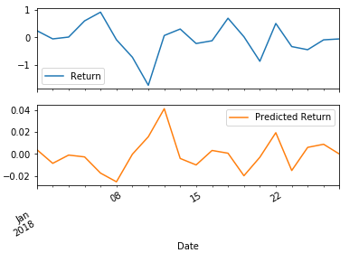

# Solution for "A Yen for the Future"

In this assignment,I have used time series tools that I have learned in order to predict future movements in the value of the Canadian dollar versus the Japanese yen.

My repository contains following starter codes:

[Time-Series Starter Notebook](Starter_Code/time_series_analysis.ipynb)

[Linear Regression Starter Notebook](Starter_Code/regression_analysis.ipynb)

[CAD/JPY Data CSV File](Starter_Code/cad_jpy.csv)

## Time Series Analysis

 ### Major Findings: 

*  Exchange rate Price vs. the Trend for 2015 to the present

* 5 day forecast using ARMA model of order (2,1)

Ques 1. Based on your time series analysis, would you buy the yen now?  
  
* Based on the current analysis, Yen is getting strongers as compared to CAD. Yes, I will buy the Yen now.

Ques 2. Is the risk of the yen expected to increase or decrease?  
  
* Risk is increasing as volatility is increasing as shown by the below figure.

## Linear Regression

Ques : Does this model perform better or worse on out-of-sample data compared to in-sample data?  
* Model performs better on In-sample data based on RMSE score.